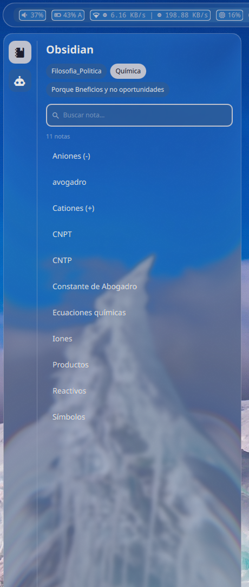
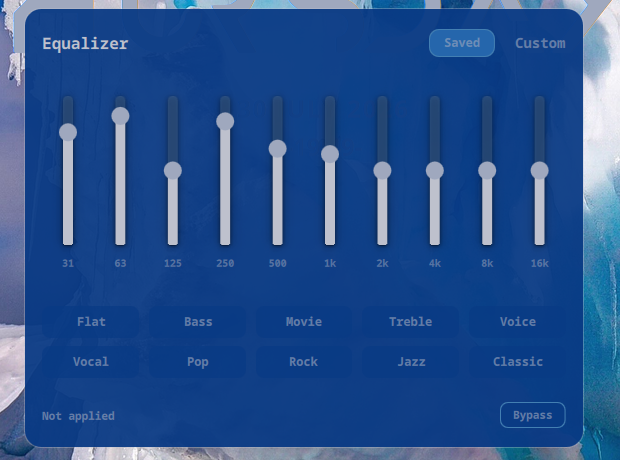

# 🐚 Quickshell Dots

[](https://quickshell.org)
[](https://hyprland.org)
[](https://archlinux.org)
[](#)

Configuración personal de [Quickshell](https://quickshell.org) para **Hyprland** en **Arch Linux**: barra, sidebar de notas/IA, ecualizador paramétrico, patchbay de PipeWire, pantalla de bloqueo con huella dactilar y sincronización de tema, todo en QML.

## ✨ Características

### Barra

📶 Red (WiFi/ethernet vía `Quickshell.Networking`), bluetooth, batería, volumen (pipewire), reproductor Spotify/MPRIS con blob audio-reactivo, CPU (binario Rust nativo), workspaces de Hyprland con indicador animado y menú de energía. Selector de wallpapers con filtro por color, orden por tono/luz y atajo global (`WIN+Q`).


### Sidebar

Panel lateral (`WIN+A`) con tres vistas: navegador de notas de **Obsidian** (búsqueda difusa sobre el vault, `obsidian://` para abrir en la app), un **editor Markdown** con preview en vivo y render de fórmulas LaTeX (`$...$`/`$$...$$` vía `latex`+`dvipng`), y un **chat con Claude Code** con sesión persistente. También incluye un panel de configuración que edita `Config/config.json` en vivo.



### Ecualizador paramétrico

Ecualizador de 10 bandas sobre PipeWire (filter-chain generado desde `eq/parametric-eq.txt`), con presets, bypass y un efecto visual de "rayo" al aplicar cambios.



### Otras

- 🔔 **Notificaciones** con historial persistente, DND y toasts con acciones.
- 🔌 **Patchbay de PipeWire** en vivo: nodos, cables y niveles reales, con recableado por arrastre (`WIN+P`). Los cables laten con el audio que los cruza.
- 🎨 **ThemeSync**: la paleta derivada del wallpaper activo se propaga a kitty, Hyprland y starship.
- 🔒 **Lock screen** propio (`Lock.qml`), reemplaza hyprlock, disparado por `loginctl`. Soporta desbloqueo por **huella dactilar** en paralelo al password (dos `PamContext` independientes, para que un prompt de fingerprint no bloquee el tipeo).

## 📦 Dependencias

- `quickshell` (paquete oficial en Arch, `pacman -S quickshell`)
- Hyprland (con soporte de dispatch vía Lua — este config usa `hl.dsp.*`, no la sintaxis hyprlang estándar)
- `pipewire` + `wireplumber` (`pw-dump`/`pw-link`/`pw-cli`/`wpctl` los usa el patchbay y el EQ)
- `jq` (el patchbay filtra los puertos de `pw-dump` con él)
- `spotifyd` (control vía MPRIS)
- `cava` (opcional — sin él, la visualización de audio anima con valores falsos)
- Rust/cargo (solo para compilar el widget de CPU, ver [Setup](#setup))
- `claude` CLI ([Claude Code](https://claude.com/claude-code)) — para el chat de la sidebar
- `texlive` (`latex` + `dvipng`, paquetes `texlive-mathscience`/`texlive-binextra`) — para el render de fórmulas en el editor de notas
- Obsidian (opcional) — solo para "abrir en Obsidian" desde la vista de notas; el vault se lee directo del filesystem
- Una Nerd Font (por defecto `JetBrainsMono Nerd Font`, configurable) para los íconos, y la fuente decorativa `Anurati` para el `ClockWidget`
- PAM: un servicio `/etc/pam.d/quickshell-lock` propio (sin `pam_fprintd`) para el lock screen, más `pam_fprintd` configurado si se quiere huella dactilar

## 🗂️ Estructura

| Carpeta | Contenido |
|---|---|
| `shell.qml` | Entrypoint. Registra los atajos globales y carga `Bar`, `ClockWidget`, `Equalizer`, `Patchbay`, `NotificationToast`, `Sidebar`. |
| `Lock.qml` | Pantalla de bloqueo standalone (reemplaza hyprlock), con auth por password + huella dactilar, lanzada con `qs -p`. |
| `Modules/` | Componentes de alto nivel montados en `shell.qml` (`Bar`, `ClockWidget`, `Equalizer`, `NotificationToast`, `Patchbay`, `Sidebar`). |
| `Widgets/Bar/` | Widgets de la barra: red, bluetooth, batería, pipewire, spotify, cpu, workspaces, power menu, selector de wallpapers. |
| `Widgets/Equalizer/` | UI del ecualizador paramétrico (canvas + controles). |
| `Widgets/Patchbay/` | Grafo del patchbay: tarjetas de nodo, pines y cables (`Shape`/`PathCubic`). |
| `Widgets/Sidebar/` | Vistas de la sidebar: navegador Obsidian, editor Markdown (`NoteEditor`), chat de Claude Code, configuración. |
| `Widgets/Lock/` | Componentes propios del lock screen (indicador de huella dactilar). |
| `Widgets/General/` | Componentes reutilizables (popups, panel, botones de media, búsqueda). |
| `Widgets/Bar/Rust/cpu/` | Binario Rust (`sysinfo`) que alimenta el widget de CPU. |
| `Services/` | Singletons de estado: `NetworkStats`, `WifiService`, `NotificationService`, `SpotifyInfo`, `ThemeSync`, `PopupState`, `SidebarState`, `CavaService`, `CpuService`, `WallpaperService`, `EqBootstrap`, `PatchbayService`, `ObsidianEditor`, `ClaudeCodeService`, `MathRender` (+ `mathrender.py`). |
| `Commons/` | Utilidades compartidas (`Colors`, `Config`, `FuzzySort`, `OrderColors`, íconos de tema, imagen circular). |
| `eq/parametric-eq.txt` | Definición de bandas del ecualizador, consumida por `scripts/eq_filter_chain.sh`. |
| `scripts/eq_filter_chain.sh` | Genera el filter-chain de PipeWire a partir de `eq/parametric-eq.txt`. |
| `scripts/lock-listener.sh` | Escucha la señal `Lock` de logind y lanza `Lock.qml` (single-instance vía `flock`). |
| `Shaders/qsb/` | Shaders QSB precompilados (blob audio-reactivo, barras del visualizador). |
| `Assets/` | Recursos runtime (`No_cover.jpg`) y `screenshots/` para este README. |
| `graphify-out/` | Grafo de conocimiento del proyecto (regenerable, ver `CLAUDE.md`). No se versiona el caché. |

## 🚀 Setup

```bash
# autostart en hyprland.conf
exec-once = qs
exec-once = ~/.config/quickshell/scripts/lock-listener.sh

# bind para bloquear
bind = $mainMod, L, exec, loginctl lock-session

# bind para el selector de wallpapers
bind = $mainMod, Q, global, quickshell:wallpaperToggle

# bind para la sidebar (notas / Claude Code)
bind = $mainMod, A, global, quickshell:sidebarToggle

# bind para el patchbay de PipeWire
bind = $mainMod, P, global, quickshell:patchbayToggle
```

El widget de CPU requiere compilar el binario Rust una vez:

```bash
cd Widgets/Bar/Rust/cpu && cargo build --release
```

Para la huella dactilar en el lock screen hace falta un servicio PAM propio (sin `pam_fprintd`, para que no bloquee el password), por ejemplo `/etc/pam.d/quickshell-lock` calcado de `/etc/pam.d/login` sin la línea de `pam_fprintd`.

## ⚙️ Configuración

`Config/config.json` guarda los valores de usuario: rutas, binarios (backend de wallpaper, comandos de poder), fuente, identidad (`user.displayName` / `user.avatar`), vault de Obsidian (`obsidian.configPath`) y los tokens de animación. Se lee en vivo — editarlo actualiza el shell sin reiniciar — y `Commons/Config.qml` también escribe en él, así que el panel de settings de la sidebar puede persistir cambios desde la UI.

El archivo se genera solo: si no existe, el shell lo escribe al arrancar con el esquema completo y los defaults declarados en `Commons/Config.qml`, así que siempre hay algo concreto que abrir y editar. Si está incompleto, las claves que falten se rellenan sin pisar las que ya tengas. Borrarlo no rompe nada — vuelve a nacer. Está en `.gitignore` porque contiene rutas propias de la máquina.

```bash
# volver a los defaults: borrarlo y reiniciar el shell
rm Config/config.json
```

Ojo: al reescribirlo, las claves quedan ordenadas alfabéticamente y se pierden los comentarios (JSON no los soporta).

## 🎨 Theming

`ThemeSync` propaga la paleta de `Colors` (derivada del wallpaper activo) a kitty, Hyprland y starship en cada cambio de wallpaper. Las tres rutas de salida son configurables en `Config/config.json` (`themeSync.*`).

## 🧠 Desarrollo

El repo mantiene un grafo de conocimiento en `graphify-out/` (god nodes, comunidades, relaciones cross-file) para navegar y consultar la config sin grep crudo — ver `CLAUDE.md` para el flujo de trabajo (`graphify query/path/explain`, `graphify update .` tras cada cambio).
